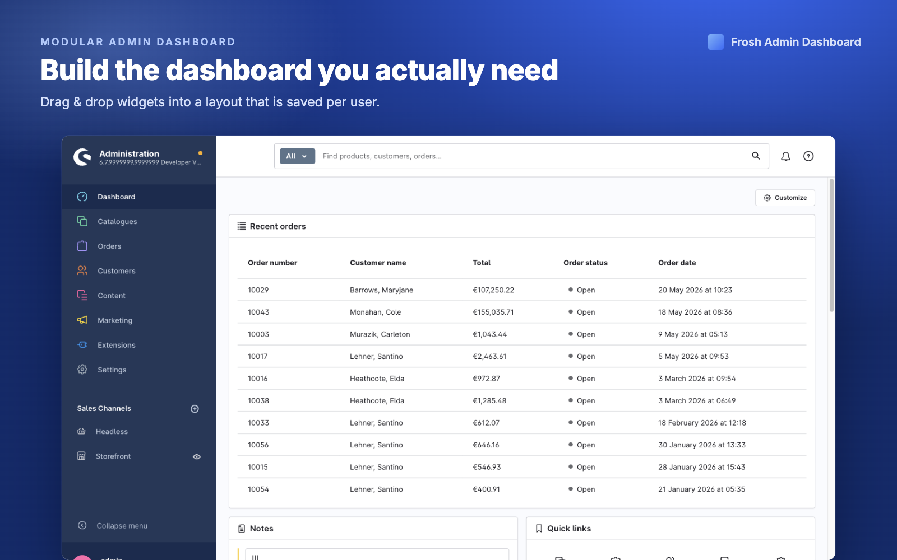

# Frosh Admin Dashboard

Turn the Shopware 6 admin dashboard into **your** dashboard.

This plugin replaces the static start page with a **modular, drag-and-drop widget
board**. Every team member builds the view they need — sales charts, open tasks,
recent orders, pending reviews — and the arrangement is saved **per user**, so
your layout is always exactly how you left it.

## What you get

- 🧩 **Drag & drop** — rearrange widgets freely; the layout is stored for each user.
- ➕ **Add, resize, remove** — an edit mode lets you shape the board in seconds, no code.
- ⚙️ **Per-widget settings** — configure widgets (e.g. limit a chart to one sales channel) via a simple dialog.
- 🔒 **Permission aware** — widgets you don't have access to are clearly marked, never broken.
- 🌍 **English & German** — fully translated.

## The widgets

**📊 Analytics** — 12 charts, each with its own time range and sales-channel filter:
Total sales · Number of orders · Average order value · New customers · Total
customers · Best-selling products · Top manufacturers · Orders by country ·
Payment methods · Shipping methods · Sales by channel · Top promotion codes.

**🛠️ Operations** — act without leaving the dashboard:
Recent orders · Recent registrations · B2B customer-group requests (approve /
decline inline) · Pending product reviews (approve, or decline with confirmation).

**✅ Productivity** — Quick links · Notes · Task list.

## Getting started

1. Install & activate the plugin (via the Shopware app manager or the console).
2. Open the **Dashboard** from the main menu — it's replaced automatically.
3. Click **Customize**, then **Add widget** to drop in what you need. Drag to
   rearrange, use the controls to resize, and the gear icon to configure.
4. Click **Done** when you're happy. Your layout is saved automatically.

## Extending it

Other plugins can add their own widgets and widget groups to the dashboard.
See **[DEVELOPER.md](DEVELOPER.md)** for the full API and examples.

## About

Part of [@FriendsOfShopware](https://store.shopware.com/en/friends-of-shopware.html).
Maintained by [Soner Sayakci](https://github.com/shyim). For questions or bugs,
please open a [GitHub issue](https://github.com/FriendsOfShopware/FroshAdminDashboard/issues/new).
